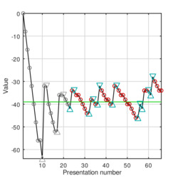

# Implementation of the Single-interval adjustment-matrix (SIAM) procedure
This software can be used to implement single-interval forced choice experiments, such as, e.g., tone-detectione experiments.

Copyright (C) 2019 Marc René Schädler

E-mail: marc.r.schaedler@uni-oldenburg.de

The script "siam.m" provided in this software package implements the SIAM procedure as proposed by Kaernbach (1990) [1].
The other scripts implement a Monte-Carlo simulation to test and optimize the procedure.

## Usage
To perform a measurement two additional functions are required: 1) A function that presents a stimulus, i.e., "presentstimulus", and 2) a function to retrieve a response from the subject, e.g., "getanswer".

An example is provided in the script "play_example_measurement.m", which implements a simple task, performs the measurement, and visualizes some information of the measurement afterwards.

To run the pre-configured Monte-Carlo simulations, just run the script "play_montecarlo_siam.m" with GNU/Octave (or Matlab).
The script sets up a virtual answerer which is always presented with the correct answer and stochastically decides on the response based on the configured psychometric function.
The simulations can help to test if the SIAM procedure works as expected (which is does not with the parameters proposed in the literature [1]).

# References
[1] Kaernbach, C. (1990). A single‐interval adjustment‐matrix (SIAM) procedure for unbiased adaptive testing. The Journal of the Acoustical Society of America, 88(6), 2645-2655. https://doi.org/10.1121/1.399985

